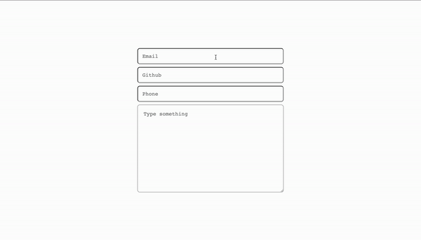
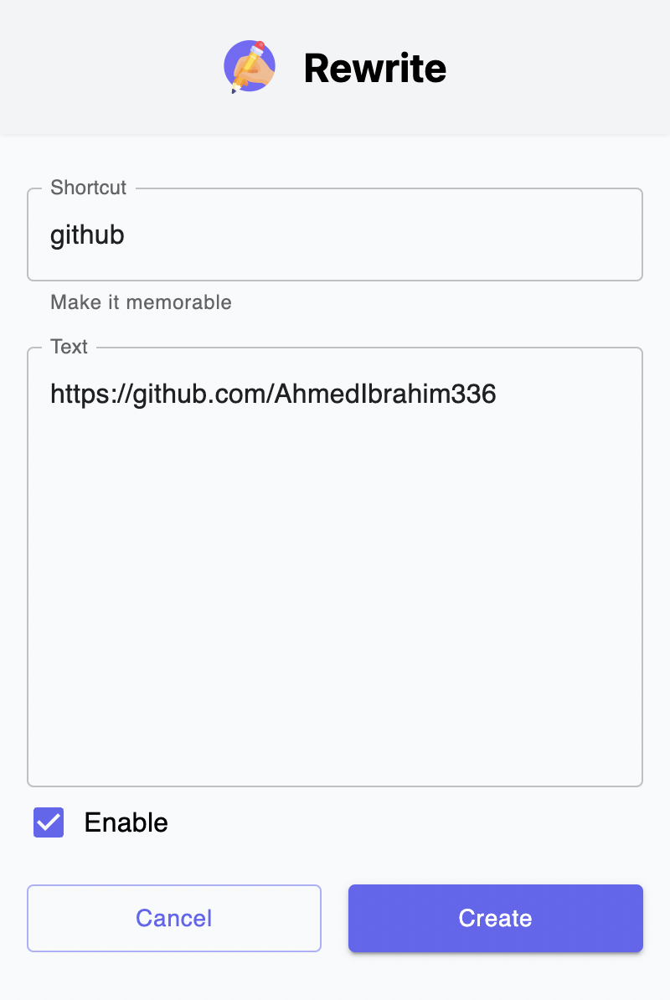
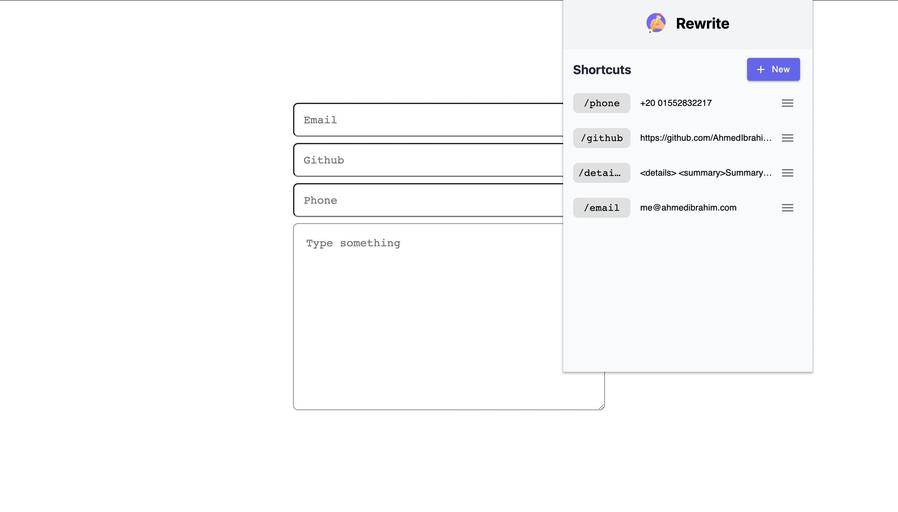

# Retype

You don't have to type it twice! You can stop typing the same text over and over again. Save all of your important info as shortcuts that you can easily retype whenever you want

 
    

## Preview

 
    

    
Screenshots

